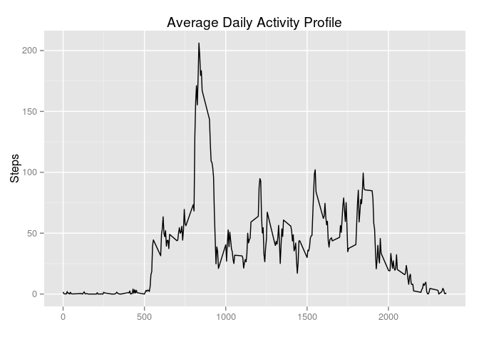

# Reproducible Research: Peer Assessment 1


## Loading and preprocessing the data

No preprocessing needed.

```r
data <- read.csv('activity.csv')
```


## What is mean total number of steps taken per day?

Begin with calculating daily sums of steps taken, then compute mean and median.

```r
daily_sum <- tapply(data$steps, data$date, sum, na.rm=TRUE)
median_daily_steps <- median(daily_sum)
  mean_daily_steps <- mean(daily_sum)
```

Use this data to plot a histogram with the input range split into 10 intervals.

```r
hist(daily_sum,10)
```

 

The mean number of steps taken per day is 9354.23, and the median daily steps taken is 10395.


## What is the average daily activity pattern?

First, create an additional column in the data frame that contains the interval column converted to a factor. Then use it to create an average daily activity pattern, then convert it to a format that ggplot understands.


```r
data$interval.factor <- as.factor(data$interval)
average_daily_activity <- tapply(data$steps, data$interval.factor, mean, na.rm=TRUE)
daily_activity_profile <- as.data.frame(average_daily_activity)
daily_activity_profile$intervals <- as.integer(labels(average_daily_activity)[[1]])
```

Now we can make the plot:


```r
library(ggplot2)
ggplot(daily_activity_profile, aes(x=intervals, y=average_daily_activity)) + geom_path() + labs(x='',y='Steps', title="Average Daily Activity Profile")
```

 

Let's find out from the daily average when was the most active 5 minute period:


```r
busiest <- daily_activity_profile[average_daily_activity == max(daily_activity_profile$average_daily_activity),]
busy_hour <- floor(busiest$intervals/60)
busy_minute <- busiest$intervals %% 60
busy_time <- paste(as.character(busy_hour),as.character(busy_minute), sep=':')
```

Assuming that we started the measurements at midnight, the most active time of the day was 13:55.

## Imputing missing values

Let's count the missing values:


```r
missing <- as.data.frame(table(is.na(data$steps)))[2,2]
missing
```

```
## [1] 2304
```

We shall apply the following strategy: for each missing value, we substitute it with the already computed average for that interval. This is embodied in the function *replace_missing* which is intended to be used together with the `apply` function:


```r
replace_missing <- function(x, rep_data){
  if(is.na(x[1])){
    interval <- as.integer(x[3])
    val <- rep_data[rep_data$intervals == interval,]
    x[1] <- as.numeric(val$average_daily_activity)
  } 
  as.numeric(x[1])
}

data$steps.replaced <- apply(data, 1, replace_missing, daily_activity_profile)
```

Now we can compute the daily sums using the replaced data and compare that to the unreplaced ones.


```r
daily_sum_replaced <- tapply(data$steps.replaced, data$date, sum)
mean(daily_sum_replaced)
```

```
## [1] 10766.19
```

```r
median(daily_sum_replaced)
```

```
## [1] 10766.19
```

We can see that both of these values are higher than their unreplaced ones. It is not evident why this is the case. Since we remove the NA's in the computation of the unimputed values, the number of samples is also adjusted. Also, the median and mean have the same values. Why?

We can see from the histogram plot above that there are a high number of days at the left. Inspecting the daily_sum variable shows that there are a high number of days with no recorded activity:


```r
daily_sum
```

```
## 2012-10-01 2012-10-02 2012-10-03 2012-10-04 2012-10-05 2012-10-06 
##          0        126      11352      12116      13294      15420 
## 2012-10-07 2012-10-08 2012-10-09 2012-10-10 2012-10-11 2012-10-12 
##      11015          0      12811       9900      10304      17382 
## 2012-10-13 2012-10-14 2012-10-15 2012-10-16 2012-10-17 2012-10-18 
##      12426      15098      10139      15084      13452      10056 
## 2012-10-19 2012-10-20 2012-10-21 2012-10-22 2012-10-23 2012-10-24 
##      11829      10395       8821      13460       8918       8355 
## 2012-10-25 2012-10-26 2012-10-27 2012-10-28 2012-10-29 2012-10-30 
##       2492       6778      10119      11458       5018       9819 
## 2012-10-31 2012-11-01 2012-11-02 2012-11-03 2012-11-04 2012-11-05 
##      15414          0      10600      10571          0      10439 
## 2012-11-06 2012-11-07 2012-11-08 2012-11-09 2012-11-10 2012-11-11 
##       8334      12883       3219          0          0      12608 
## 2012-11-12 2012-11-13 2012-11-14 2012-11-15 2012-11-16 2012-11-17 
##      10765       7336          0         41       5441      14339 
## 2012-11-18 2012-11-19 2012-11-20 2012-11-21 2012-11-22 2012-11-23 
##      15110       8841       4472      12787      20427      21194 
## 2012-11-24 2012-11-25 2012-11-26 2012-11-27 2012-11-28 2012-11-29 
##      14478      11834      11162      13646      10183       7047 
## 2012-11-30 
##          0
```

These days get all replaced by the averaged profile, which has the same mean as the mean of all samples. Thus, there are a lot of days whose steps equal the mean, and since they appear around the middle of the ordered distribution it also becomes the median.

## Are there differences in activity patterns between weekdays and weekends?

Let's first classify the data between workdays and weekends. Define a helper function for this as follows:


```r
wkday <- function(x) {
  ddate <- weekdays(as.Date(x))
  classifier <- function(d) {
    if (d %in% c("Saturday","Sunday")){
      "weekend"
    } else {
      "weekday"
    }
  }
  as.factor(mapply(classifier, ddate))
}
```

We'll use this function to create a new factor which we append as a new column in our data. We can now perform the same computation as earlier, this time using the new factorial.


```r
data$day.class <- wkday(data$date)
days_compared <- tapply(data$steps.replaced, list(data$day.class,data$interval.factor), mean)
```

Now let's not bother to massage this into a format that ggplot would understand, instead use base plotting:


```r
days_compared <- as.data.frame(t(days_compared))
days_compared$interval <- as.integer(labels(days_compared)[[1]])
par(mfrow=c(2,1))
plot(days_compared$interval, days_compared$weekday, type='l', main="Weekday activity",
     xlab="", ylab="Steps")
plot(days_compared$interval, days_compared$weekend, type='l', main="Weekend activity",
          xlab="", ylab="Steps")
```

 
